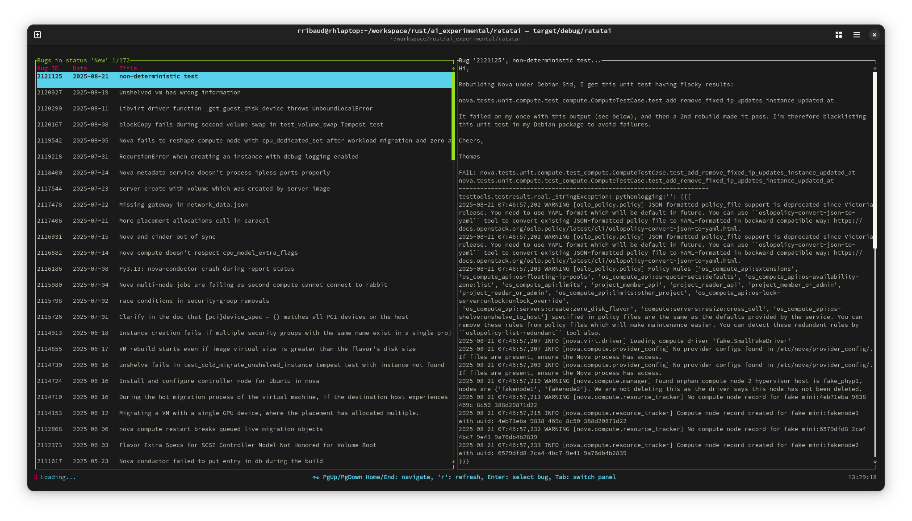
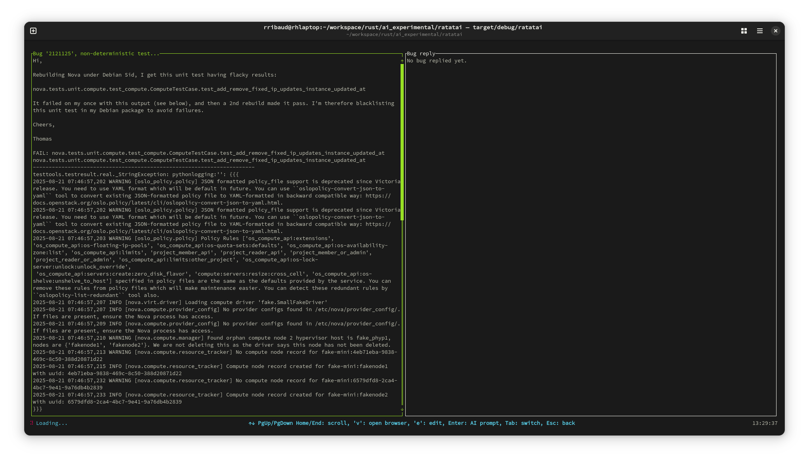

# ratatai: Launchpad Bug Management TUI

ratatai is a Terminal User Interface (TUI) application written in Rust designed for
browsing and managing Ubuntu Launchpad bugs with AI-powered assistance.

It provides an interactive terminal interface for viewing bug lists, examining
bug details, and generating AI-assisted responses to incomplete/invalid bugs.
The application integrates with the Ubuntu Launchpad API to fetch bug
information and uses Google's Gemini AI to help analyze bugs and suggest
responses.

This project is part of exploring and becoming familiar with Artificial
Intelligence concepts and tooling, specifically focusing on AI-assisted
bug triage and response generation for open-source projects.

While it uses Rust—a language well-suited for system tools—it's primarily
an experimental and learning-oriented project, not production-ready code.
It was an excellent opportunity to dive into asynchronous Rust, terminal
user interfaces with ratatui, and AI integration patterns. This foundational
work serves as a base for future explorations into more advanced AI concepts
in developer tooling.

The application acts as a bridge between the Launchpad API and AI services,
orchestrating data fetching, UI rendering, and AI processing in a responsive
terminal interface.

## Features

ratatai currently supports the following operations:

1. **Bug Browsing**: Interactive terminal interface for browsing Launchpad bugs.
   - Displays bug lists with titles and status information.
   - Navigate between bug list and detail views.
2. **Bug Details**: View comprehensive bug information including descriptions and comments.
   - Scroll through bug content with keyboard navigation.
   - Real-time fetching of detailed bug information.
3. **AI-Powered Analysis**: Generate AI-assisted responses and analysis for bugs.
   - Uses Google Gemini AI for intelligent bug analysis.
   - Contextual responses based on bug content and history.

All processing uses the Ubuntu Launchpad public API for bug data and Google's
Gemini AI service for intelligent analysis. The TUI is built with ratatui
for a responsive terminal experience, and all operations are asynchronous
to maintain UI responsiveness during network operations.

The modular design separates concerns between the API client, TUI components,
and AI integration, allowing for easy extension and testing.

## Screenshots

### Bug List and Details View

*Main interface showing the bug list on the left and detailed bug information on the right. Navigate through bugs and view their full descriptions and comments.*

### AI-Assisted Bug Response

*Bug editing screen where you can craft AI-assisted responses. The left panel shows bug details while the right panel displays the generated response for further editing.*

## How to Build

To build and run ratatai, you need the Rust toolchain installed. You can
find the installation instructions on the [Rust programming language official
site](https://www.rust-lang.org/).

A Google API key is required for AI functionality.

### Clone the Repository

First, clone the ratatai repository to your local machine:

```bash
git clone https://github.com/uggla/ratatai.git
cd ratatai
```

### Install dependencies

#### 1- Install build dependencies

**For Fedora (using dnf):**

```bash
sudo dnf install openssl-devel gcc
```

**For Ubuntu/Debian (using apt):**

```bash
sudo apt-get update
sudo apt-get install gcc libssl-dev pkg-config build-essential
```

#### 2- Setup environment

Create a `.env` file in the project root with your Google API key:

```bash
echo "GEMINI_API_KEY=your_api_key_here" > .env
```

To get a Google API key:

1. Go to the [Google AI Studio](https://aistudio.google.com/)
2. Create a new API key for Gemini
3. Add it to your `.env` file

### Build the ratatai Project

Navigate to the project root directory and run:

```bash
cargo build --release
```

This will compile the project in release mode, producing an optimized executable.

### Container Alternative

You can also run ratatai using Podman with full development environment support:

```bash
# Build and run with the provided script (recommended)
./run-podman.sh

# Or build and run separately
./run-podman.sh build
./run-podman.sh run

# Or manually
podman build -t ratatai -f Containerfile .
podman run -it --env-file .env --volume "$(pwd):/app:Z" --userns=keep-id --rm ratatai
```

**Container Features:**
- **Neovim included** - Full text editing capabilities for file management
- **Volume mapping** - Current directory mounted as `/app` for seamless file access
- **User mapping** - Uses `--userns=keep-id` for proper file permissions
- **Log persistence** - Application logs saved to host `./logs` directory
- **SELinux compatibility** - Works correctly on Fedora/RHEL systems

## Usage

ratatai is a TUI application with keyboard-driven navigation:

```bash
# Run the application locally
cargo run

# Or run the release build
cargo run --release

# Set log level for debugging
RUST_LOG=debug cargo run

# Run in container with full development environment
./run-podman.sh
```

### Keyboard Controls

#### Global Controls (Available everywhere)
| Key | Action |
| :-- | :----- |
| `q` | Quit application |

#### Bug List Screen - Left Panel (Bug Table)
| Key | Action |
| :-- | :----- |
| `↑/↓` | Navigate through bug list |
| `PageUp/PageDown` | Navigate by page through bug list |
| `Home/End` | Go to first/last bug in list |
| `Enter` | Select bug and fetch detailed information |
| `r` | Refresh bug list |
| `Tab` | Switch to right panel (bug details) |

#### Bug List Screen - Right Panel (Bug Details)
| Key | Action |
| :-- | :----- |
| `↑/↓` | Scroll bug description up/down |
| `PageUp/PageDown` | Scroll bug description by page |
| `Home/End` | Go to top/bottom of bug description |
| `v` | Open bug in web browser |
| `e` | Edit AI response content in external editor |
| `Enter` | Enter AI triage mode |
| `Tab` | Switch to left panel (bug table) |

#### Bug Editing Screen - Left Panel (Bug Details)
| Key | Action |
| :-- | :----- |
| `↑/↓` | Scroll bug description up/down |
| `PageUp/PageDown` | Scroll bug description by page |
| `Home/End` | Go to top/bottom of bug description |
| `v` | Open bug in web browser |
| `e` | Edit AI response content in external editor |
| `Enter` | Generate AI response (sends bug content to AI) |
| `Tab` | Switch to right panel (available after first AI generation) |
| `Esc` | Return to Bug List screen |

#### Bug Editing Screen - Right Panel (Bug Reply)
| Key | Action |
| :-- | :----- |
| `e` | Edit reply content in external editor |
| `Enter` | Send reply for AI processing |
| `Tab` | Switch to left panel (bug details) |
| `Esc` | Return to Bug List screen |

#### Debug Keys (May be removed in future versions)
| Key | Action |
| :-- | :----- |
| `s` | Toggle spinner animation |
| `a` | Generate AI analysis of current bug (in bug details panels) |

### Environment Variables

| Variable         | Description                                 | Default |
| :--------------- | :------------------------------------------ | :------ |
| `GEMINI_API_KEY` | Google API key for Gemini AI (required)     | None    |
| `RUST_LOG`       | Log level (error, warn, info, debug, trace) | info    |

## **Project Structure**

This is a Rust workspace with two main components:

```
ratatai/
├── ratatai/                    # Main TUI application
│   ├── src/
│   │   ├── main.rs            # Application entry point
│   │   ├── lib.rs             # Core application loop
│   │   ├── app.rs             # Application state management
│   │   ├── ui.rs              # UI rendering logic
│   │   ├── events.rs          # Input event handling
│   │   └── ai.rs              # AI integration (system instruction, version fetching)
│   └── Cargo.toml
├── launchpad_api_client/       # Launchpad API client library
│   ├── src/
│   │   ├── lib.rs             # API data structures
│   │   ├── client.rs          # HTTP client implementation
│   │   └── fake.rs            # Mock client for testing
│   ├── examples/              # Usage examples
│   └── Cargo.toml
├── Containerfile              # Container build configuration  
├── run-podman.sh              # Podman runner script with development environment
├── CLAUDE.md                  # Claude Code guidance file
└── logs/                      # Application log files
```

## **Known Issues & Future Improvements**

- **Error Handling**: Limited error recovery when API calls fail or network is unavailable
- **Bug Project Configuration**: Currently hardcoded to fetch "nova" project bugs
- **UI Responsiveness**: Long AI responses may cause temporary UI freezing
- **Offline Mode**: No offline capability when Launchpad API is unavailable
